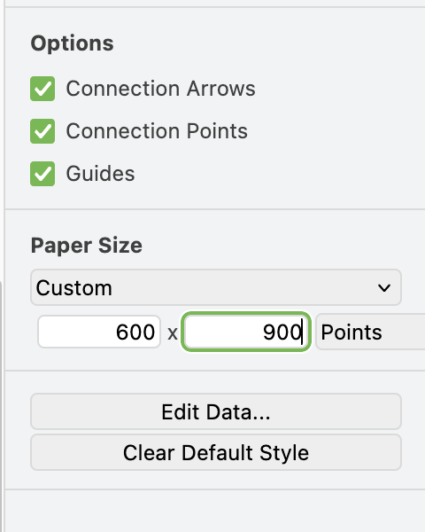

# Week 11 - UI Design
In today's prac, we will be looking at applying some of the principles of UI design from the live lecture in creating our cards and interface for our table top game.

## Tools used
Today's task uses (but is not limited to):

* Github Desktop (or your Github client of choice)
* app.diagrams.net
* playingcards.io

## Assignment deliverable
Today, you will be creating a card for your table top game. This might be speculative for redesign with your group later, or based on a template you've already established with your group.

## Info and layout design
Refering back to the lecture and your notes for best practice, consider what information the player will need on your cards and how this should be displayed. Think about:
* What information is important and needs to be displayed?
* What is the "heirarchy" of information? What is the most crucial thing for the player to know, and therefore should be clear?
* What information is better left off the card, so as not to clutter it too much?
* Where do you need words, and where can symbols/iconography be used instead?

Spend some time thinking about this, and try designing the card with a rough template-like layout. Start with pen and paper. You can create cards with custom sizes on playingcards.io, but by default they have a 2x3 size, so start by working within that restriction. We have provided a number of print-outs of a blank card sheet with these dimensions that you can get started with - ask your instructor for one (you'll need your own pen/pencil).

Note that if your game has multiple types of cards, that's okay. Pick the one you consider the most crucial (or, if possible, coordinate with another group member to work on a different card design - you can sync up later).

Once you've got a template, take another look at it and ask yourself:
* Have I effectively used conventions to make this readable? E.g., having resources required to do something in a simple icon-number format in the top right of the card is a common approach.
* Is all the info on the card relevant to using the card? Information about the game more broadly, or how other cards behave, probably isn't relevant and just getting in the way.
* Where does the player need to look to determine which card this is? It shouldn't be difficult for the player to differentiate between their cards (This may become clearer later).
* Do any opportunities for natural mapping exist? E.g., the use of colour to indicate certain elements, or leveraging known iconography.
* Are any of these elements diagetic? Should they be?

With these questions answered (and any tweaks in response made), it's time to build a version of this we can import into playingcards.io!

## app.diagrams.net and templates
Broadly speaking, there are two main ways to create cards in playingcards.io: using the in-built editor to arrange text and images, or to import a complete card as an image, with text and everything else embedded in the image. You can use a combination of techniques, but for today we are going to focus on just importing a complete card, as this seems the least painful approach.

Note: if you have experience with other graphic design software that you'd rather use, you absolutely can use that. The below is meant as a few tips to get someone new to graphic design started, using app.diagrams.net as it is free and browser based. As a Macquarie University student, you have access to the Adobe Creative Cloud.

### Digitising your template
You've now got a card template! We are going to digitise it in app.diagrams.net (formerly draw.io). Create a new file and set the dimensions to a custom 2x3 dimensions (I've gone with 600x900 pixels to give me a decent level of fidelity).

From here, you can start adding shapes and layers to create your card template. You want to have elements on meaningful layers to allow you to change things like text, etc for each card.

Once you are happy with your template, save this as a template file. You'll want to keep this file and re-use it to create individual cards. Be careful not to save over your template!

## Art work sourcing and direction

## Implementation

## Automation/UX

## Reflect
Include a section on reflection to ensure students are doing something with their knowledge in the moment.

## Next Week
Next week you will be playtesting your assignment game during these sessions, so make sure you are organising with your group how you will be running your playtest and collecting data.
