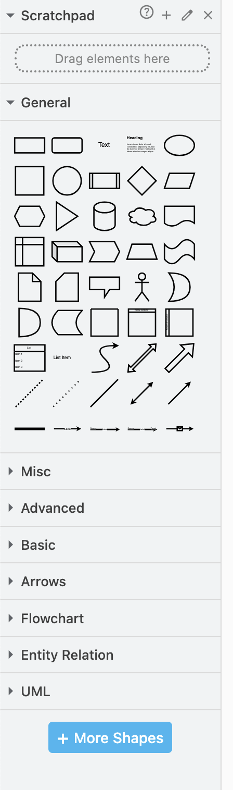
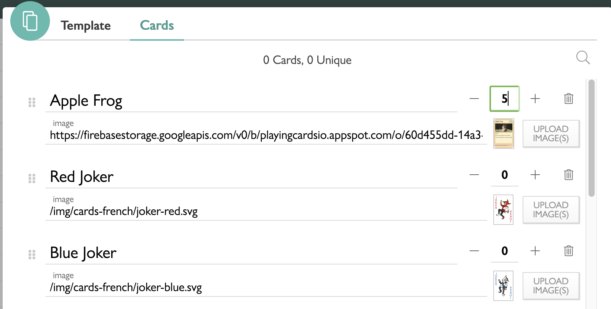

# Week 11 - UI Design
In today's prac, we will be looking at applying some of the principles of UI design from the live lecture in creating our cards and interface for our tabletop game.

## Tools used
Today's task uses (but is not limited to):

* GitHub Desktop (or your GitHub client of choice)
* app.diagrams.net
* playingcards.io

## Assignment deliverable
Today, you will be creating a card for your tabletop game. This might be speculative and made for redesign with your group later, or based on a template you've already established with your group.

## Info and layout design
Referring back to the lecture and your notes for best practice, consider what information the player will need on your cards and how this should be displayed. Think about:
* What information is important and needs to be displayed?
* What is the "hierarchy" of information? What is the most crucial thing for the player to know, and therefore should be clear?
* What information is better left off the card, so as not to clutter it too much?
* Where do you need words, and where can symbols/iconography be used instead?

Spend some time thinking about this, and try designing the card with a rough template-like layout. Start with pen and paper. You can create cards with custom sizes on playingcards.io, but by default they have a 2x3 size, so start by working within that restriction. We have provided a number of print-outs of a blank card sheet with these dimensions that you can get started with - ask your instructor for one (you'll need your own pen/pencil).

Note that if your game has multiple types of cards, that's okay. Pick the one you consider the most crucial (or, if possible, coordinate with another group member to work on a different card design - you can sync up later).

Once you've got a template, take another look at it and ask yourself:
* Have I effectively used conventions to make this readable? E.g., having resources required to do something in a simple icon-number format in the top right of the card is a common approach.
* Is all the info on the card relevant to using the card? Information about the game more broadly, or how other cards behave, probably isn't relevant and will just get in the way.
* Where does the player need to look to determine which card this is? It shouldn't be difficult for the player to differentiate between their cards.
* Do any opportunities for natural mapping exist? E.g., the use of colour to indicate certain elements, or leveraging known iconography.
* Are any of these elements diegetic? Should they be?

With these questions answered (and any tweaks in response made), it's time to build a version of this we can import into playingcards.io!

## app.diagrams.net and templates
Broadly speaking, there are two main ways to create cards in playingcards.io: using the in-built editor to arrange text and images, or to import a complete card as an image, with text and everything else embedded in the image. You can use a combination of techniques, but for today we are going to focus on just importing a complete card, as this seems the least painful approach.

Note: if you have experience with other graphic design software that you'd rather use, you absolutely can use that. The below is meant as a few tips to get someone new to graphic design started, using app.diagrams.net as it is free and browser based. As a Macquarie University student, you have access to the Adobe Creative Cloud.

### Digitising your template
You've now got a card template! We are going to digitise it in [app.diagrams.net](https://app.diagrams.net) (formerly draw.io). Create a new file, deciding where to save the file (I am going to store mine locally).

You also have the opportunity to select a template to use here. I've had a bit of a look and found most of the templates aren't suitable, so I'd just select "Blank Diagram" and go from there. You want to save your diagram as an xml file, not an svg. You can export this to png or similar later.

Next we need to set the dimensions. As we are working with cards, let's go with something that matches our paper prototypes so far and set this to a custom 2x3 dimensions. I'm setting mine to 600x900 to give me a good bit of fidelity for placing items and scaling things.

From here, you can start adding shapes and layers to create your card template. Each shape or text object you add will be placed as an element, but you can add new layers to give you more flexibility here.

There are a lot of different shapes you can add. Generally speaking, the more basic shapes are the most useful here, but get creative! Try to follow your paper prototype, but don't be afraid to iterate if something seems to catch your eye.

When a shape has been added, like with most interfaces of this type, you can modify objects in the diagram directly, or via the menus on the right.

You can also add text objects, and add text to shapes by clicking on them and typing. Experiment with changing colours and properties of your various elements. 

When deciding on your colours, consider learning a little bit of [Colour Theory](https://www.interaction-design.org/literature/topics/color-theory) to help your cards look good. It doesn't need to be a lot, but a little thought goes a long way. I find [Coolors](https://coolors.co/) is a good resource for generating colour palettes!

You can also add fonts by selecting "Custom..." from the drop-down. You can add a font from [Google Fonts](https://fonts.google.com/) by simply specifying the font name. Make sure you spell this correctly, as it will not display otherwise.

When adding text, there are a few properties to be aware of. These work much like text properties in any other editor, but pay special attention to the padding option, that allows you to refine how your text sits inside a box. I found I had to set both `padding-right` and `padding-top` to 10px to get things look good.

Some of these options are, weirdly enough, only on the shape containing the text, such as text overflow. Turn this off to stop text from being constantly vertically centred.

Keep adding shapes to match your template, creating space for any images you need to insert (such as your main image). For your template, you also want to write text, numbers, etc. so that you can ensure the cards will look good no matter what info is inserted. For example, a number value that may reach triple digits should be set-up with triple digits in the template.

Here is an example template I created. I also like to embed the "rules" of each element in my sample text, as you can see:

Once you are happy with your template, save this as a template file. You'll want to keep this file and re-use it to create individual cards. Be careful not to save over your template!

## Making a card
Let's create an actual card from our game. If you aren't quite there yet, use this as an opportunity to start the design process.

Save your template as a new file which we will use for the card itself. Make sure you then open this file so you don't accidentally change your template.

### Art sourcing and direction
The next step is to find artwork to insert into your cards. Using public domain images, creating images yourself, or finding other images you have permissions to use are all perfectly valid, as long as you provide sources. Any use of generative AI will also necessitate acknowledgement. You may wish to even include this info as part of your card design!

Whatever way you go, make sure your cards have consistent art direction. If you have a photograph on one card and pixel art on another, things will look out of place.

Once you've got some art (this can be placeholder for today if need be), go ahead and upload it into your diagram. I find that selecting "reduce size" makes things work a bit better, as otherwise the image might not load properly.

When you insert your image, you might find it doesn't quite fit the box you gave yourself in your layout. You may wish to crop your image, but this might also be a good opportunity to reconsider your layout a bit. Just make sure that any changes you make you apply to your template.

You can crop the image in another app and then re-upload, or use diagrams.net's own image cropping tool.

Once everything looks good, you should have a completed card. Don't forget to add any border or other modifications to your image to ensure it fits in nicely:

## Implementation
Now, let's get that card into our game!

Select `File > Export` and export your card as a PNG, adjusting the settings as you see fit.

### Uploading to playingcards.io
Open up your card game file (or create a new one if you're just experimenting for today). Add/select your custom deck and press the "Cards" button (this should be familiar from previous weeks). You can now rename or create a new card and select "UPLOAD IMAGE(S)" and navigate to your image on your computer. From here, you can set how many copies of this card are in this deck.

With the card now added, you might want to revisit the deck's settings in the sidebar. We really recommend turning "Enlarge" on. Remember that these settings are as much a part of your UI/UX as the card layout itself.

Finally, head back into the game and draw one of your cards from the deck. Take a look at how it is on the playing field. Does anything need to change? I've noticed that my card is actually a bit too small because of the padding I had when creating the card! With this knowledge, I can go back and make some modifications (or change the card dimensions in playingcards.io). Like everything, UI design is iterative!

## Automation/UX
With any time remaining, you may want to revisit the automation/UX components of your game. As stated earlier, it's pretty powerful what you can do with automation in playingcards.io. Check out [the docs here](https://playingcards.io/docs/) and experiment.

## Next Week
Next week you will be playtesting your assignment game during these sessions, so make sure you are organising with your group how you will be running your playtest and collecting data. If you are not yet in a group, you are desperately running out of time to join one!
